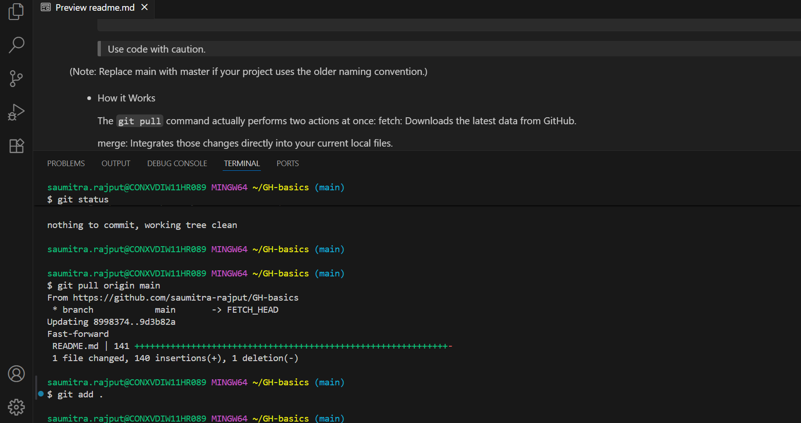

# gh pull

To get the latest updates from your GitHub repository to your local machine in 2026, use the git pull command.

- The Quick Command
Open your VS Code terminal and run:

    ```
    git pull origin main
    ```
    > Use code with caution.

    Example :
    


(Note: Replace main with master if your project uses the older naming convention.)

- How it Works

    The `git pull` command actually performs two actions at once:
    fetch: Downloads the latest data from GitHub.


    merge: Integrates those changes directly into your current local files.

- Safe Approach (Fetch then Merge)

    If you want to see what the changes are before mixing them with your code:

    Download changes: `git fetch origin`


    Compare: `git diff main origin/main`

    Apply changes: `git merge origin/main`
