# Certification

:shipit:

## Task 1

The Nautilus dev team is currently in the process of creating Git repositories, a new requirement has emerged to create a repository on the storage server. Below are the details for this request.

Create and initialise a git repository at /home/sarah/story-blog-t1q3 on Storage server.

Use below credentials to SSH into the storage server and to complete this task.

Username: sarah
Password: S3cure321

Created and initialised a git repository at '/home/sarah/story-blog-t1q3' on Storage server?

## Commands Used

Login into the server and create the folder if not exists
- 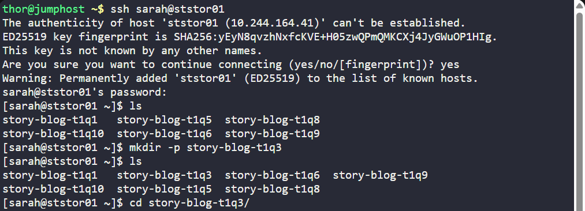

Init git repo 
- 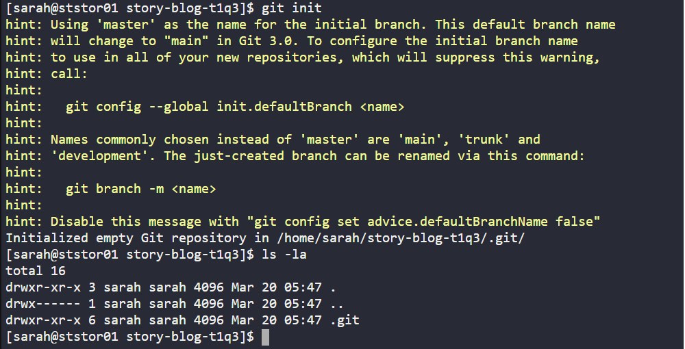
## What I Learned

## Notes

---

## Task 2
The developers are adding some content under new repositories. There was some data added under /home/sarah/story-blog-t1q8 repository on the storage server. Commit the files that are currently in the staging area under this repository.

First check the status of the file using the command git status. Then commit using the commit message as Added the lion and mouse story

Use below credentials to SSH into the storage server and to complete this task.

## Commands Used

Change the path and check the status and do commit
- 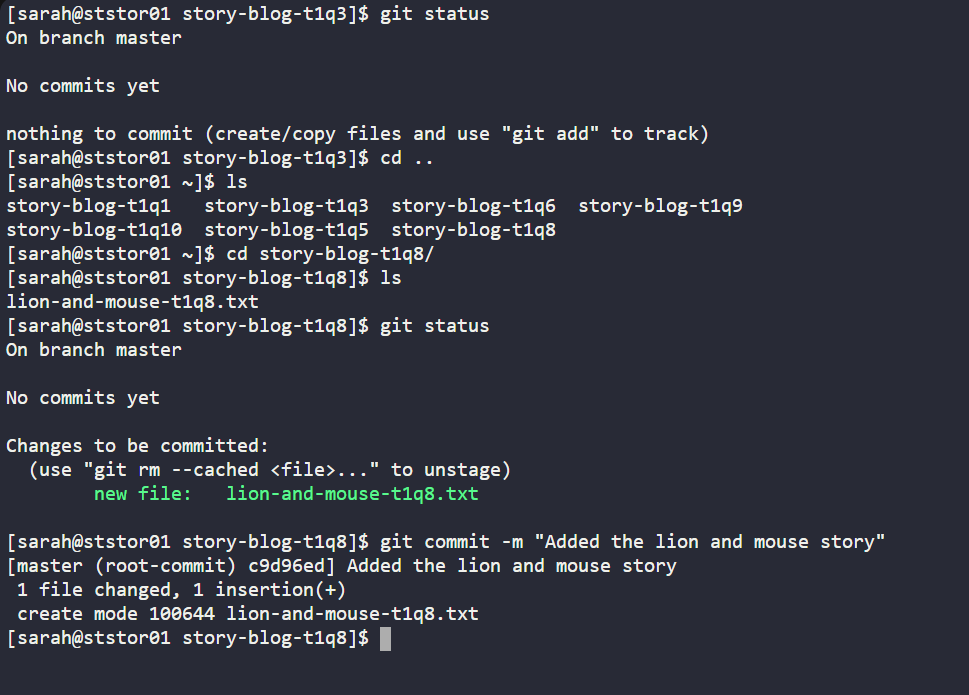
## What I Learned

## Notes

---

## Task 3
Sarah created a new file named notes-t1q9.txt under /home/sarah/story-blog-t1q9 repository where she plans to write down ideas about the story for personal purposes. She does not want git to track this file or share it with her team mates.

It is good that the file is untracked. But it is still under GIT's radar. If you run the git add . command, accidentally git will start to track this file.

Let's configure git to ignore this file permanently.

Use below credentials to SSH into the storage server and to complete this task.

## Commands Used

Go to the path and check the status
- 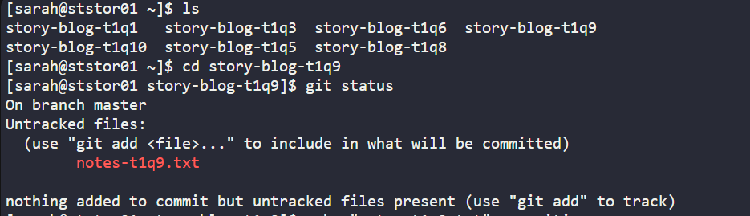

Using echo command to write the file name in the .gitignore file and check the status
- 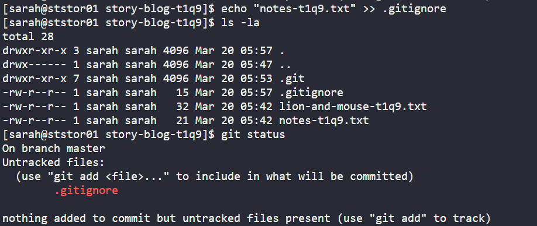

Use git add and commit the changes
- 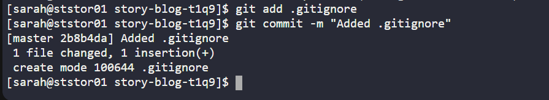
## What I Learned

## Notes

---

## Task 4
The Nautilus application development team has been working on a project repository /opt/media-t2q3.git. This repo is cloned at /usr/src/kodekloudrepos/media-t2q3 on storage server in Stratos DC. They recently shared the following requirements with DevOps team:

Create a new branch datacenter-t2q3 in /usr/src/kodekloudrepos/media-t2q3 repo from master and copy the /tmp/index-t2q3.html file (present on storage server itself) into the repo. Further, add/commit this file in the new branch and merge back that branch into master branch. Finally, push the changes to the origin for both of the branches.

Use below credentials to SSH into the storage server and to complete this task.

## Commands Used
Go to the path check the current branch 
- 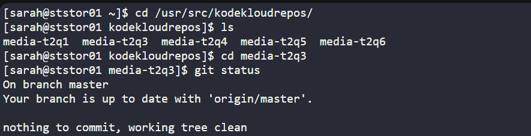

Create the new branch copy the required file check the status
- 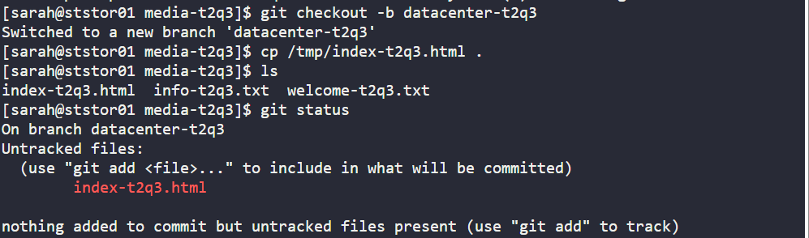

Add changes and commit 
- 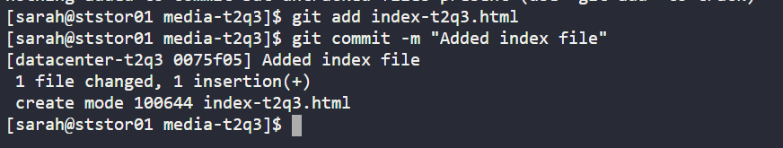

Go to the master branch and merge the other branch
- 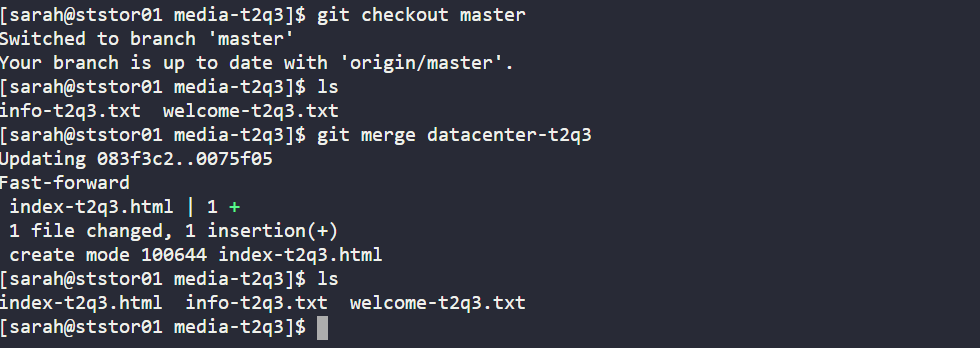

Push the changes to both origin branches
- 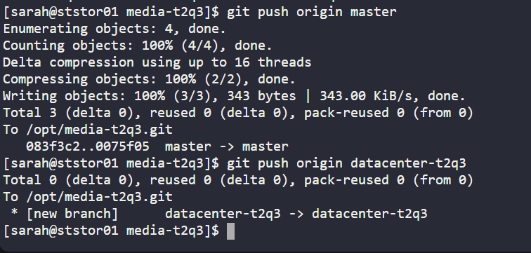
## What I Learned

## Notes

---

## Task 5
Nautilus developers are actively working on one of the project repositories, /usr/src/kodekloudrepos/media-t2q1. Recently, they decided to implement some new features in the application, and they want to maintain those new changes in a separate branch. Below are the requirements that have been shared with the DevOps team:

On Storage server in Stratos DC create a new branch xfusioncorp_media-t2q1 from master branch in /usr/src/kodekloudrepos/media-t2q1 git repo.

Please do not try to make any changes in the code.

Use below credentials to SSH into the storage server and to complete this task.

## Commands Used

Go to the path and create new branch and then check branches
- 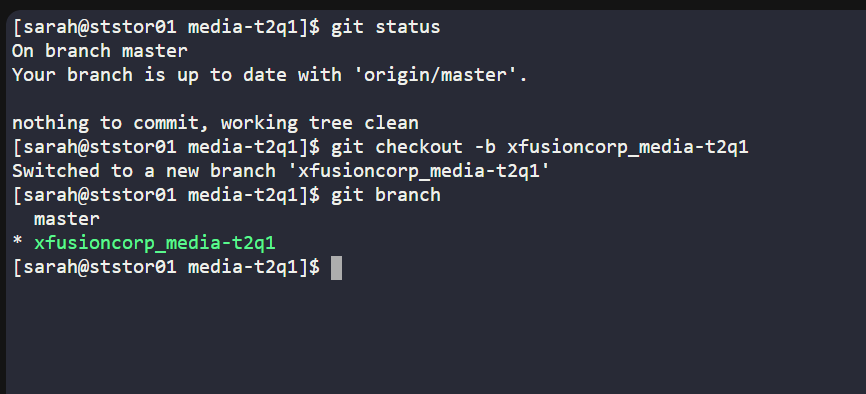

## What I Learned

## Notes

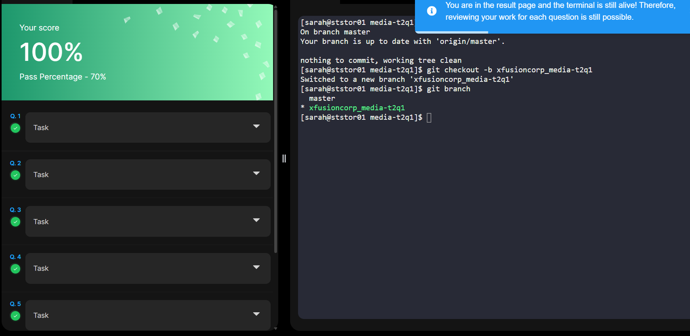