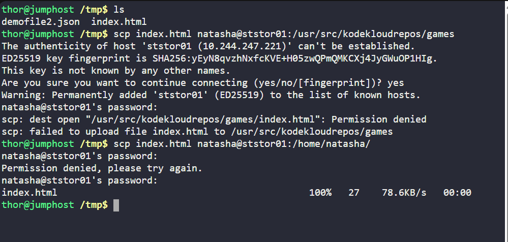
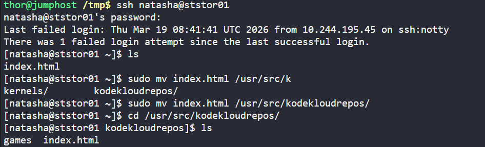
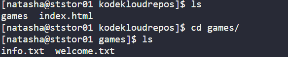
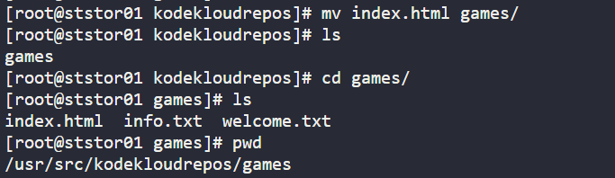
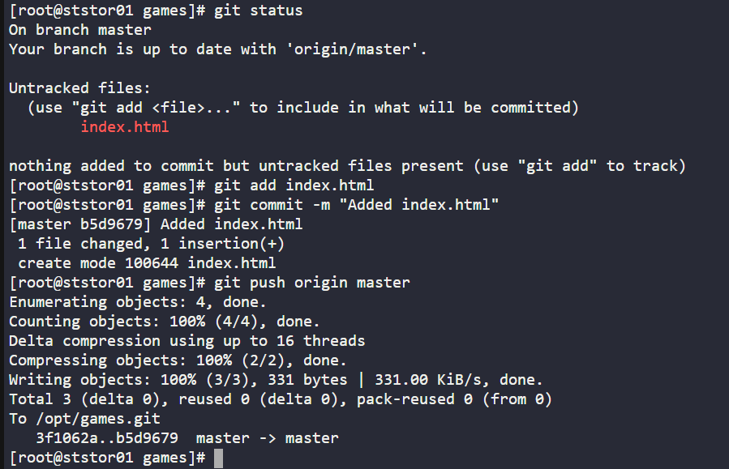
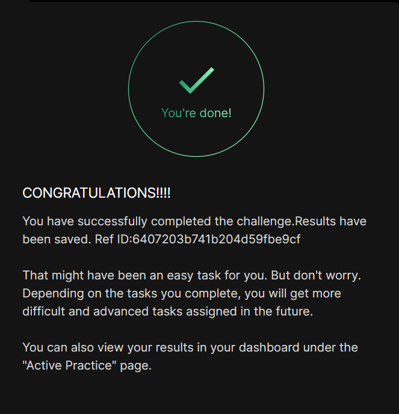

# Day 04
:shipit:

## Task

The Nautilus development team has initiated a new project development, establishing various Git repositories to manage each project's source code. Recently, a repository named /opt/games.git was created. The team has provided a sample index.html file located on the jump host under the /tmp directory. This repository has been cloned to /usr/src/kodekloudrepos on the storage server in the Stratos DC.


Copy the sample index.html file from the jump host to the storage server placing it within the cloned repository at /usr/src/kodekloudrepos/games.

Add and commit the file to the repository.

Push the changes to the master branch.

## Commands Used


```
sudo mv /usr/src/kodekloudrepos/index.html /usr/src/kodekloudrepos/games/
cd /usr/src/kodekloudrepos/games
sudo git add index.html
sudo git commit -m "Added index.html"
sudo git push origin master
```
Copy the file to the storage server using scp file user@server:/path/anything

> note: I tried to move directory to the destination path not worked due to sudo or it's belongs to the root

So copied the file to the user's home.
- 

ssh to the server and check the file and move the destination path
- 

as per the requirements
- /opt/games.git is original repo
- /usr/src/kodekloudrepos Repo cloned on storage server at: 

  
- The cloned repository name is games, so the actual working directory is: /usr/src/kodekloudrepos/games
- so move the file from kodekcloudrepos to inside games(which is git repo)
  


> note use sudo or root user because repo belongs to root : error: dubious ownership
- add the file and commit and push to master branch
  


## What I Learned

- A Git repository only tracks files that are inside the repository directory (the folder containing `.git`).
- The actual cloned repository in this lab was `/usr/src/kodekloudrepos/games`, not `/usr/src/kodekloudrepos`.
- Files placed outside the repository folder will not appear in `git status`.
- Git may block operations with a **"dubious ownership"** error if the repo owner and the current user differ.
- This can be resolved by marking the repository as safe or using sudo when required.

## Notes

- Always confirm the repository location before running Git commands:

ls -a




