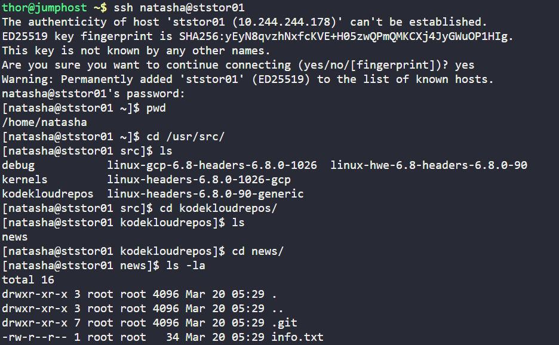
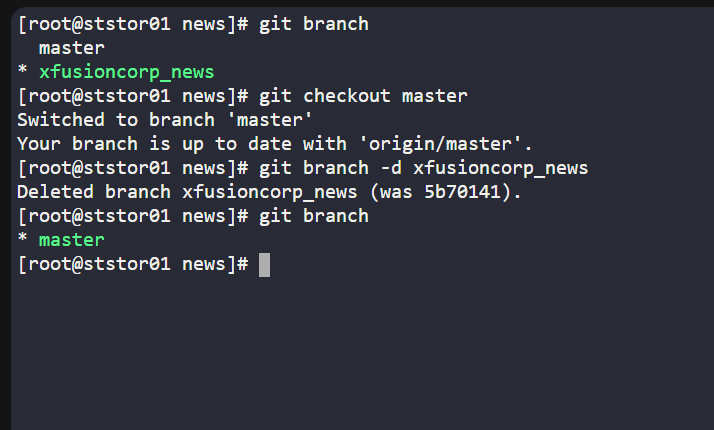
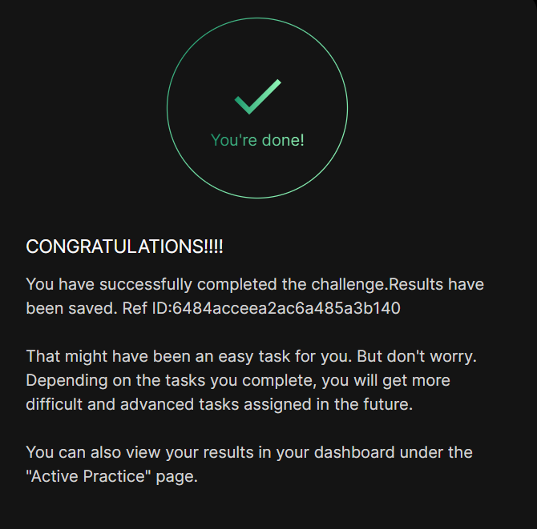

# Day 05
:shipit:

## Task

The Nautilus developers are engaged in active development on one of the project repositories located at /usr/src/kodekloudrepos/news. During testing, several test branches were created, and now they require cleanup. Here are the requirements provided to the DevOps team:

On the Storage server in Stratos DC, delete a branch named xfusioncorp_news from the /usr/src/kodekloudrepos/news Git repository.

## Commands Used
```
cd /usr/src/kodekloudrepos/news
below commands are used with the sudo because repo owns by root
git branch
git branch -d xfusioncorp_news
git branch
```

Login into the Server and go the required path
- 

Switch to the master branch and deleted the branch x
- 

## What I Learned

Used git branch -d to delete a local Git branch safely.

If a branch is not fully merged, git branch -D force deletes it.

Verified branch removal by listing branches again.

## Notes

-d = safe delete

-D = force delete

This task was done inside the repository at /usr/src/kodekloudrepos/news

